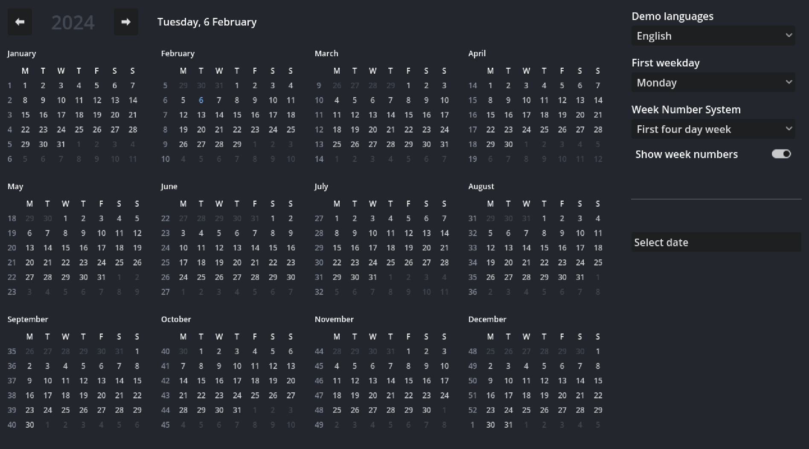

# Calendar Library for Godot 4

Calendar is a comprehensive library for creating calendar views, including yearly, monthly, weekly overviews, and agendas. It adheres to Godot's date handling conventions and the `Time` singleton, with weeks going from `Sunday = 0` to `Saturday = 6`. Just like `Time`, Calendar follows the Proleptic Gregorian Calendar, meaning the day before 1582-10-15 is 1582-10-14, not 1582-10-04. Weekdays from 1582-10-15 are valid.

The Calendar library comes with a Date class that stores a date as `year`, `month` and `day`, and comes with handy utility functions.

The library also facilitates formatted and localized date representations through the CalendarLocale resource. Each Calendar object is linked to a CalendarLocale, which can be customized or replaced as needed.

This is a code library for generating calendar data. A demo project is available with an example of how to present a year calendar using the library and control nodes.

### CalendarLocale
A resource to define localized names for weekdays and months

CalendarLocale is used by Calendar objects to represent the correct localized versions of weekday and month names. All Calendar objects get a default English CalendarLocale assigned at creation. You can create a new CalendarLocale resource and set new localized names in the Inspector. You can assign a new CalendarLocale to any Calendar object.

## Features
- Generate full year, month and week calendars through simple functions.
- Supports variable start of the week (any weekday can be the first).
- Supports week numbers with two versions - "First four day week" (where Week 1 is the first week with four days in it) and "Traditional" (where Week 1 is the week containing January 1).
- Localization for day names and month names in three versions, Full (e.g. "Monday", "January"), Abbreviation (e.g. "Mon", "Jan") and Short (e.g. "M", "J").
- Customizable date format through POSIX placeholders (e.g. "%A, %-d %B" become "Wednesday, 21 October"). Supports any divider characters.
- A Date class with functions for manipulating and comparing dates.

## Documentation
Full documentation is supported in the editor through the Documentation Help section
